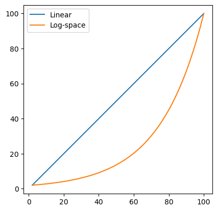

```python
import numpy as np
import matplotlib.pyplot as plt
```


```python
np.linspace(1, 2, 10)
```


    array([1.        , 1.11111111, 1.22222222, 1.33333333, 1.44444444,
           1.55555556, 1.66666667, 1.77777778, 1.88888889, 2.        ])


```python
np.logspace(1, 2, 10)
```


    array([ 10.        ,  12.91549665,  16.68100537,  21.5443469 ,
            27.82559402,  35.93813664,  46.41588834,  59.94842503,
            77.42636827, 100.        ])


---
#### Exercise


```python
a = 2
b = 100
n = 50

x = np.linspace(a, b, n)
log_x = np.logspace(np.log10(a), np.log10(b), n)
# log_x = np.logspace(a, b, n)

f_lin = x
f_log = log_x

plt.plot(x, f_lin, label='Linear')
plt.plot(x, f_log, label='Log-space')

plt.axis('square')
plt.legend()
plt.show()

```

    [  2.           2.16622145   2.3462577    2.54125688   2.75246259
       2.98122176   3.22899326   3.49735724   3.78802515   4.10285067
       4.44384158   4.81317248   5.21319875   5.64647149   6.11575384
       6.62403859   7.17456726   7.77085076   8.41669182   9.1162092
       9.87386398  10.694488    11.58331468  12.54601239  13.5887206
      14.71808906  15.94132014  17.26621486  18.70122254  20.25549474
      21.93894365  23.76230521  25.73720768  27.87624574  30.1930608
      32.70242805  35.42035063  38.36416174  41.55263513  45.00610486
      48.74659497  52.79795994  57.1860368   61.93880991  67.08658946
      72.66220471  78.7012134   85.2421285   92.32666381 100.        ]
    


    

    


```python

```
