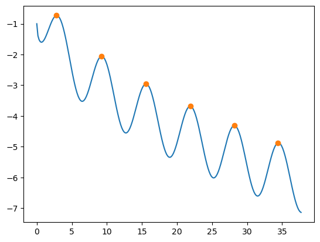

```python
import numpy as np
from scipy.signal import find_peaks
import matplotlib.pyplot as plt
```


```python
x = np.linspace(0, 12*np.pi, 231)
f_x = -np.cos(x) - np.sqrt(x)

# Find peak_max value and peak_maxarg
peeks = find_peaks(f_x)


plt.plot(x, f_x)
plt.plot(x[peeks[0]], f_x[peeks[0]], 'o')

plt.show()

```


    

    


```python

```
